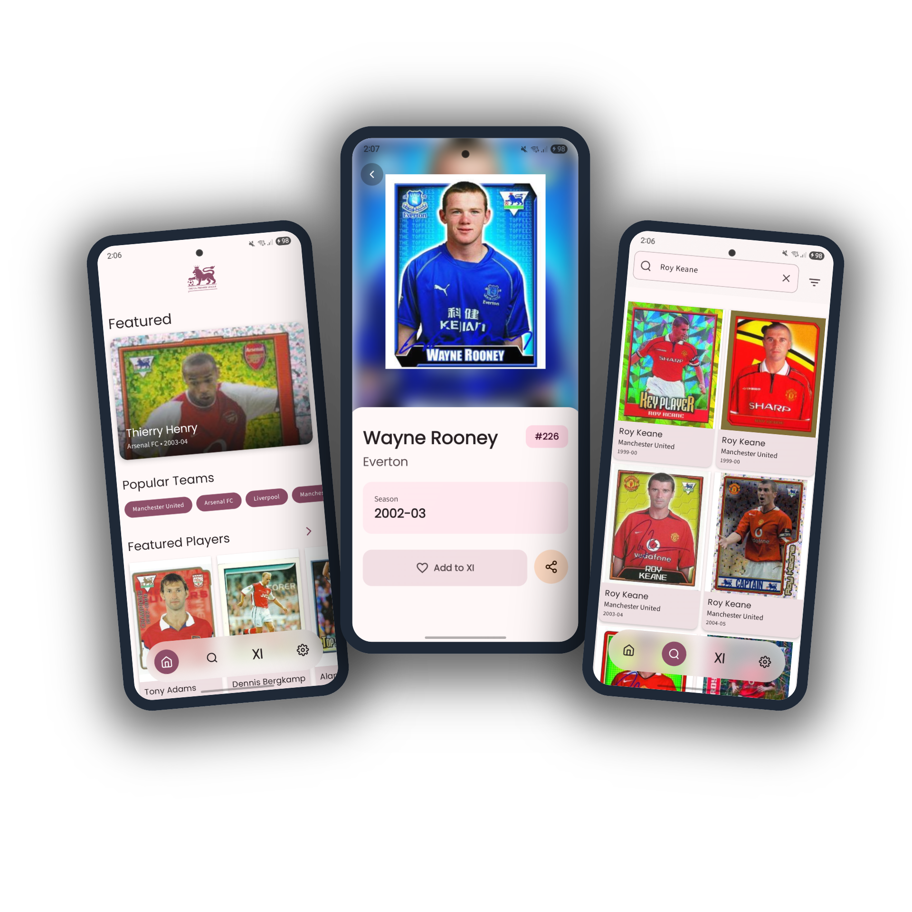
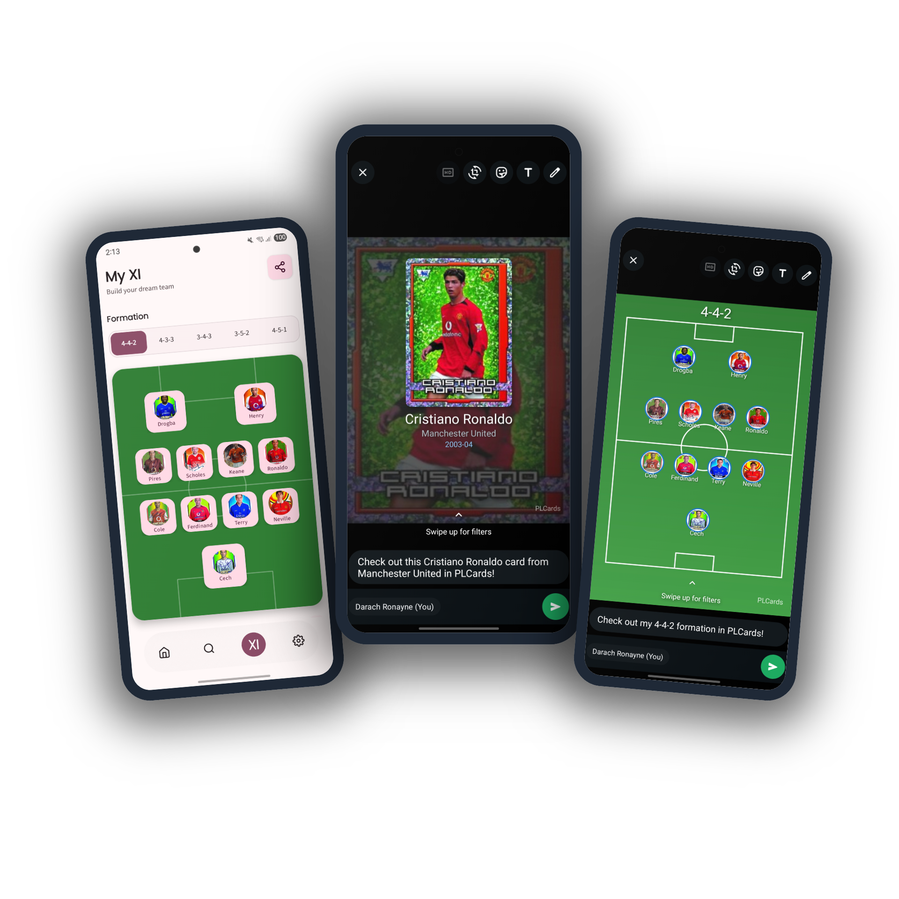

 

# PLCards

A modern, feature-rich Android application for browsing, collecting, and curating a team from football trading cards.

## Overview

PLCards is an offline-first Android application designed for football card enthusiasts. It features cards from the Premier League era (98-08 for now) and includes a special hidden "WC2002 Mode" that transforms the app's theme and content to celebrate the iconic 2002 FIFA World Cup.

  
  
  


## Key Features

### Core Functionality

- **Dynamic Home Feed**: Curated shelves featuring "Golden Boot Winners," "Forgotten Heroes," and more
- **Advanced Search**: Real-time search with suggestions and multi-faceted filtering
- **My XI Team Builder**: Interactive formation builder to create your dream PL team
- **Offline-First Design**: Full functionality without network connection after initial sync
- **Adaptive Layouts**: Optimised experiences for phones and tablets using WindowSizeClass

### User Experience

- **Material 3 Design System**: Complete implementation with Dynamic Color support
- **Smooth Animations**: SharedTransitionLayout for seamless navigation animations
- **Dark Mode**: Full dark theme support with system preference detection
- **Easter Egg**: Hidden WC2002 mode with complete theme transformation

## Architecture

PLCards follows Clean Architecture principles with MVVM pattern, ensuring scalability, testability, and maintainability.

### Key Architectural Components

1. **Unidirectional Data Flow**: State flows down, events flow up
2. **Single Source of Truth**: Repository pattern abstracts data sources
3. **Dependency Injection**: Hilt for clean dependency management
4. **Reactive Programming**: Kotlin Flow throughout the architecture

## Technical Stack

### Core Technologies
- **Language**: 100% Kotlin
- **UI Framework**: Jetpack Compose
- **Architecture**: MVVM + Clean Architecture
- **Dependency Injection**: Hilt
- **Asynchronous**: Coroutines & Flow

### UI & Design
- **Design System**: Material 3
- **Navigation**: Navigation Compose
- **Image Loading**: Coil 3
- **Animations**: SharedTransitionLayout Compose Animations
- **Responsive**: WindowSizeClass

### Data & Storage
- **Database**: Room with Paging 3
- **Networking**: Retrofit + OkHttp
- **JSON**: Moshi
- **Preferences**: DataStore
- **Background**: WorkManager

### Analytics
- **Analytics**: Firebase Analytics
- **Crash Reporting**: Firebase Crashlytics

## Screen Breakdown

### Home Screen
- **LazyColumn** with horizontal card shelves
- **HorizontalPager** for featured cards carousel
- Reactive UI updates via combined Flows
- Curated content with deterministic shelf data

### Search Screen
- **Paging 3** integration for efficient list loading
- Debounced search with Flow operators
- **ModalBottomSheet** for advanced filtering
- Chip-based filter visualization

### Card Detail Screen
- Hero animation with **SharedTransitionScope**
- Overlapping content layout
- "Add to MyXI" and share actions

### My XI Screen
- Custom **Canvas** football pitch drawing
- Dynamic formation layouts (4-4-2, 4-3-3, etc.)

### Settings Screen
- **DataStore** backed preferences
- Theme selection including hidden WC2002 mode
- Cache management options
- App information display

### Project Structure
```  
PLCards/  
├── app/                    # Application module  
├── core/  
│   ├── common/            # Shared utilities  
│   ├── data/              # Data layer  
│   ├── domain/            # Business logic  
│   └── ui/                # UI components  
├── features/  
│   ├── home/              # Home feature  
│   ├── search/            # Search feature  
│   ├── detail/            # Card detail  
│   ├── myxi/              # Team builder  
│   └── settings/          # Settings  
└── buildSrc/              # Build configuration  
```
